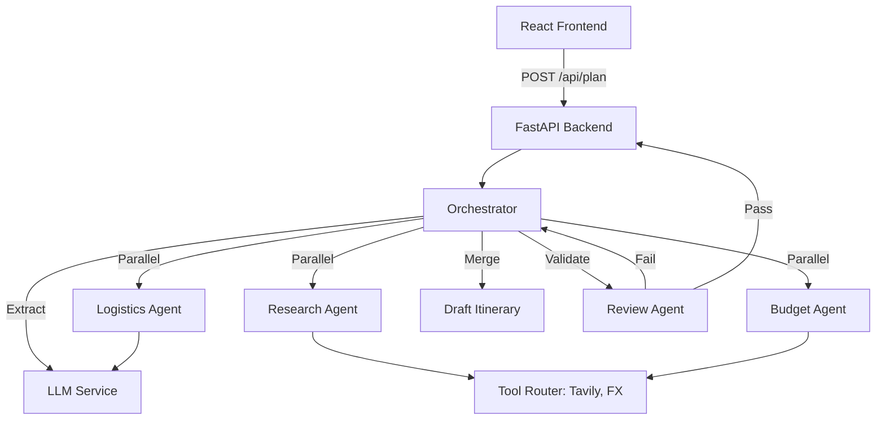

# AI Travel Planner 🌍✈️

A production-grade, multi-agent AI system designed to craft personalized, realistic, and budget-optimized travel itineraries.

## 🚀 Overview

The AI Travel Planner leverages a sophisticated multi-agent orchestration pipeline to transform natural language travel requests into structured, verified plans. It integrates real-time web research, financial tools (FX conversion), and rigorous constraints validation.

### Key Features
- **Multi-Agent Orchestration**: Specialized agents for Research, Logistics, and Budgeting.
- **Self-Repair Loop**: A Review Agent validates drafts and triggers repairs if constraints (budget, duration) aren't met.
- **Hybrid LLM Intelligence**: Primary execution on **Groq (Llama 3.3)** with seamless fallback to **Gemini**.
- **Real-time Tools**: Integrated Tavily Search for live data and Exchange Rate API for financial accuracy.
- **Production Hardened**: Global exception handling, trace ID tracking, exponential backoff retries, and TTL caching.

---

## 🏗️ Architecture



---

## 🛠️ Setup & Installation

### Backend
1. **Environment**: Python 3.12+ recommended.
2. **Install Dependencies**:
   ```bash
   cd backend
   pip install -r requirements.txt
   ```
3. **Configuration**: Create a `.env` file from `.env.example`.
4. **Run Server**:
   ```bash
   python -m uvicorn app.main:app --host 0.0.0.0 --port 8000 --reload
   ```

### Frontend
1. **Install Node.js** (LTS recommended).
2. **Install Dependencies**:
   ```bash
   cd frontend
   npm install
   ```
3. **Run Dev Server**:
   ```bash
   npm run dev
   ```

---

## 📡 API Usage

### Generate Plan
`POST /api/plan`

**Request Body**:
```json
{
  "request": "Plan a 3-day trip to Paris for $1000. I love art and wine."
}
```

**Query Parameters**:
- `demo` (bool): Set to `true` for instant mock results (Demo Mode).

**Response Structure**:
```json
{
  "trace_id": "uuid",
  "summary": "Customized trip to France",
  "itinerary": [...],
  "budget_breakdown": {
    "grand_total": 850.0,
    "within_budget": true
  },
  "review_report": {
    "is_valid": true
  }
}
```

---

## 🧪 Documentation & Testing

- **Orchestrator Pipeline**: Manages the state machine of the plan generation. It ensures that if one agent fails (e.g., Search tool timeout), the system attempts a graceful fallback or repair.
- **Testing**: Run integration tests using `pytest backend/tests/test_pipeline.py`.
- **Logging**: All logs include a `trace_id` for correlating frontend errors with backend pipeline execution.
