# AI Travel Planner — System Architecture

This document describes the complete architecture for the multi-agent travel planning system. The system turns a natural-language travel request into a structured trip plan by coordinating specialized agents.

## 1. System Flow Diagram (Source of Truth)

The following sequence diagram represents the authoritative orchestration logic for the system.

```mermaid
sequenceDiagram
    participant U as User
    participant O as Orchestrator
    participant D as Destination Agent
    participant L as Logistics Agent
    participant B as Budget Agent
    participant R as Review Agent

    U->>O: Send NL travel request
    O->>O: Extract constraints (cities, duration, prefs, avoidances, budget)
    
    rect rgb(30, 30, 30)
        Note over O, B: Parallel Execution
        par Orchestrator to Workers
            O->>D: Task Brief (prefs, cities, duration, avoidances)
            O->>L: Task Brief (cities, duration, rough intent)
            O->>B: Task Brief (budget cap, duration, cities)
        and Workers to Orchestrator
            D-->>O: ActivityCatalog
            L-->>O: LodgingPlan + MovementPlan + DaySkeleton
            B-->>O: BudgetBreakdown + flags
        end
    end

    O->>O: Merge into DraftItinerary
    
    O->>R: DraftItinerary + Constraints
    R-->>O: ReviewReport

    alt Review Fails or has Warnings
        loop Repair Loop (Max 2-3 retries)
            O->>O: Revise (swap items, rebalance days, trim cost)
            O->>R: Re-review
            R-->>O: ReviewReport
        end
    end

    O->>U: Final Itinerary
```

## 2. Orchestration Logic
Implementation must strictly follow the flow defined in the diagram above:

- **Centralized Control**: The **Orchestrator** is the only agent that manages the overall flow and state.
- **No Direct Communication**: Specialist agents (Destination, Logistics, Budget) **must not** communicate with each other. They receive read-only constraints from the Orchestrator.
- **Parallelism**: Specialist agents run concurrently to minimize latency.
- **Review Gate**: The **Review Agent** acts as a hard validation gate. A plan cannot be delivered to the user without passing the review or exhausting the repair attempts.
- **Repair Loop**: The Orchestrator is responsible for interpreting `ReviewReport` and performing bounded repairs (swapping items, adjusting budgets, etc.).

## 3. Backend Architecture (FastAPI)
- **Framework**: FastAPI (Asynchronous).
- **Key Endpoints**:
    - `GET /health`: Liveness check.
    - `POST /api/plan`: Main entry point for the orchestration pipeline.
- **Observability**: `trace_id` propagation across all agent calls and logs.

## 4. Frontend Architecture (React)
- **Framework**: React (Vite-based).
- **UI Components**:
    - `RequestInput`: For natural language input.
    - `ItineraryDisplay`: Day-by-day sequence.
    - `BudgetVisualizer`: Cost breakdown.
- **Safety**: Mandatory disclaimer handling for AI-generated content.

## 5. Shared Data Model
All agents communicate using the shared typed schemas defined in Phase 1:
- `TravelConstraints`
- `ActivityCatalog`
- `LodgingPlan`
- `MovementPlan`
- `DaySkeleton`
- `BudgetBreakdown`
- `DraftItinerary`
- `ReviewReport`

## 6. Deployment Flow
- **Backend**: Deployed as Serverless Functions on Vercel.
- **Frontend**: Deployed on Vercel (Next.js).
- **Secrets**: Managed via environment variables.
